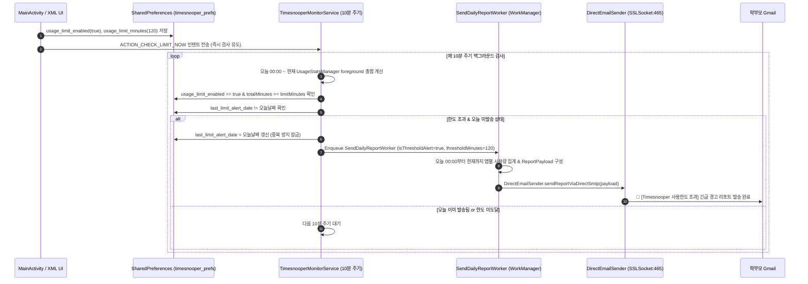

# 🚨 Usage Limit Instant Alert Feature Reference

> 이 문서는 Timesnooper의 **일일 기기 사용시간 한도 초과 시 즉시 메일 발송(Instant Usage Threshold Alert)** 기능의 아키텍처, 데이터 흐름, SharedPreferences 설정 키, 중복 방지(Deduplication) 메커니즘을 상세히 기록한 LLM 임베딩 및 에이전트 지식 레퍼런스입니다.

---

## 📌 1. 기능 개요 (Feature Overview)

- **배경 및 목적**: 기존의 Timesnooper는 매일 밤 지정된 시각(기본 22:00)에만 정기 일일 리포트를 발송했으나, 자녀가 낮 시간 동안 과도하게 기기를 사용할 경우 실시간 대응이 어렵다는 한계가 있었습니다.
- **핵심 기능**:
  1. 학부모가 설정한 **일일 사용 한도 시간(분 단위, 예: 120분 / 2시간)** 에 도달하면, 정기 발송 시각을 기다리지 않고 **학부모 Gmail로 즉시 긴급 리포트를 발송**합니다.
  2. **중복 발송 방지(Deduplication)**: 10분 주기 백그라운드 루프에서 당일 날짜(`last_limit_alert_date`)를 추적하여 당일 **단 1회만** 발송하고, 이후 추가 사용으로 인한 메일 폭탄/스팸을 차단합니다.
  3. **정기 일일 리포트와의 공존**: 낮에 한도 초과 경고 메일이 발송되어도 밤 10시 정기 리포트(하루 마감 총결산)는 그대로 정상 발송됩니다.

---

## 🔄 2. 데이터 흐름 및 시퀀스 다이어그램 (Workflow)



---

## 🗄️ 3. 데이터 모델 및 SharedPreferences 명세

### 1) SharedPreferences 키 (`timesnooper_prefs`)

| Key | Type | Default | Description |
| :--- | :--- | :--- | :--- |
| `usage_limit_enabled` | `Boolean` | `false` | 일일 사용시간 한도 초과 시 즉시 메일 발송 활성화 여부 |
| `usage_limit_minutes` | `Int` | `120` | 설정된 일일 사용 제한 시간 (분 단위, 예: 120 = 2시간) |
| `last_limit_alert_date` | `String` | `""` | 가장 최근에 한도 초과 알림이 발송된 날짜 (`yyyy-MM-dd`). 당일 중복 발송 방지용 |

### 2) Kotlin 데이터 모델 (`ReportPayload.kt`)

```kotlin
data class ReportPayload(
    @SerializedName("deviceId") val deviceId: String,
    @SerializedName("deviceName") val deviceName: String,
    @SerializedName("childName") val childName: String = "자녀",
    @SerializedName("recipientEmail") val recipientEmail: String = "jpark04092@gmail.com",
    @SerializedName("androidVersion") val androidVersion: String,
    @SerializedName("reportDate") val reportDate: String,
    @SerializedName("totalScreenTimeMinutes") val totalScreenTimeMinutes: Int,
    @SerializedName("apps") val apps: List<AppStatEntry>,
    // 신규 추가된 한도 초과 메타데이터
    @SerializedName("isThresholdAlert") val isThresholdAlert: Boolean = false,
    @SerializedName("thresholdMinutes") val thresholdMinutes: Int = 0
)
```

---

## 🛠️ 4. 컴포넌트별 세부 구현 내용

### 1) `TimesnooperMonitorService.kt`
- **검사 주기**: `SingleThreadScheduledExecutor`가 10분 주기로 `collectAndBufferUsageStats()` 및 `checkUsageLimitAndTriggerAlert()` 동시 실행.
- **당일 사용량 계산**: `Calendar`를 통해 오늘 00:00:00부터 `System.currentTimeMillis()`까지의 `UsageStats` 집계.
- **즉시 트리거 액션**: `ACTION_CHECK_LIMIT_NOW` (`"com.timesnooper.app.ACTION_CHECK_LIMIT_NOW"`) 수신 시 10분을 기다리지 않고 비동기 즉시 검사.

### 2) `SendDailyReportWorker.kt`
- **WorkManager InputData**:
  - `KEY_IS_THRESHOLD_ALERT` (`"is_threshold_alert"`): `Boolean`
  - `KEY_THRESHOLD_MINUTES` (`"threshold_minutes"`): `Int`
- **집계 범위**: 초과 알림 시 오늘 00:00:00부터 현재까지의 정확한 실시간 사용 내역 집계.

### 3) `DirectEmailSender.kt`
- **제목 분기**:
  - 초과 알림: `🚨 [Timesnooper 사용한도 초과] {자녀이름} 기기 일일 사용시간({N}시간 {M}분) 초과 알림 ({날짜})`
  - 일반 정기: `[Timesnooper] {자녀이름} 기기 일일 스크린타임 보고서 ({날짜})`
- **HTML 템플릿 분기**:
  - 초과 알림 시 헤더 배경색을 긴급 경고 레드(`#991B1B`)로 변경하고, 상단에 **⚠️ 일일 사용시간 한도 초과 안내 배너**를 렌더링.

### 4) `MainActivity.kt` & `activity_main.xml`
- **UI 요소**:
  - 체크박스 (`cbUsageLimitEnabled`): 활성화 여부 토글 (체크 시 입력 컨테이너 표시)
  - 분 단위 입력창 (`etUsageLimitMinutes`): `number` inputType
  - 빠른 프리셋 버튼: `1시간`(60m), `1.5시간`(90m), `2시간`(120m), `3시간`(180m)
- **저장 및 유효성 검사**: 1분 이상 양수 값 검증 후 `SharedPreferences`에 저장하고, 즉시 백그라운드 서비스로 검사 인텐트 송신.
